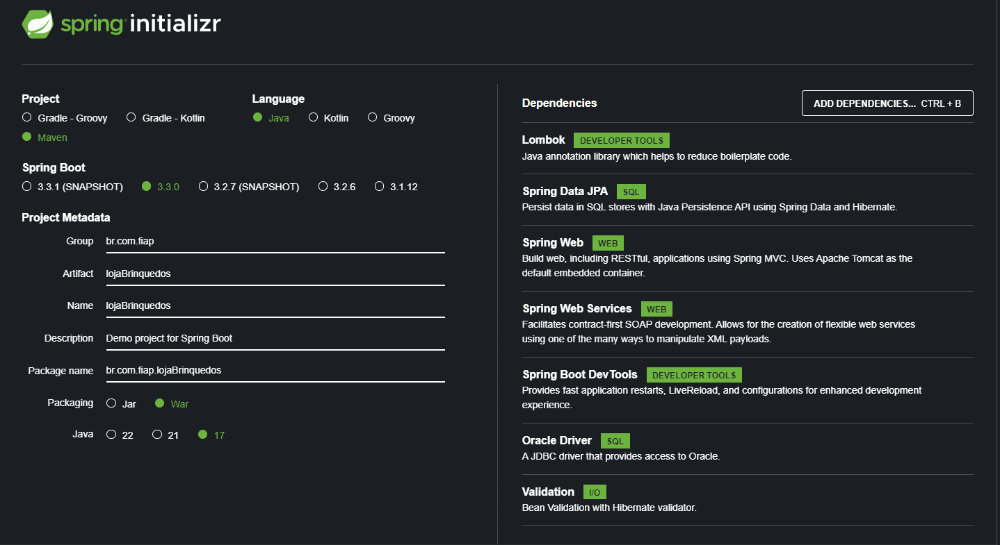
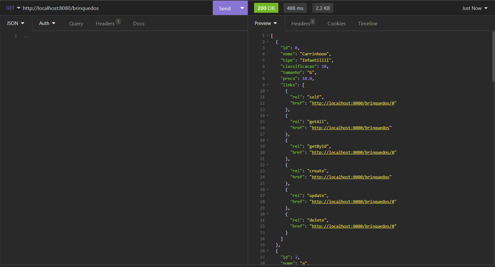
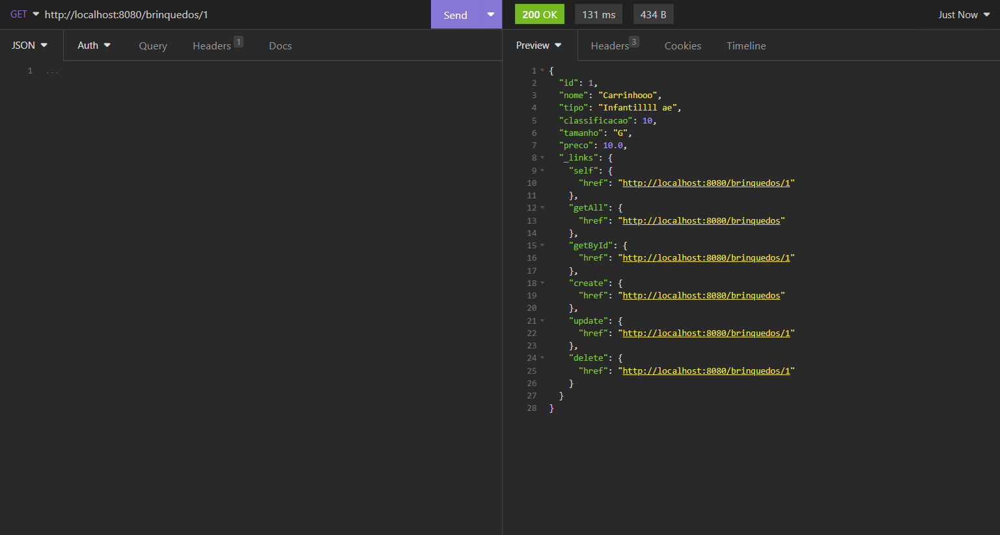
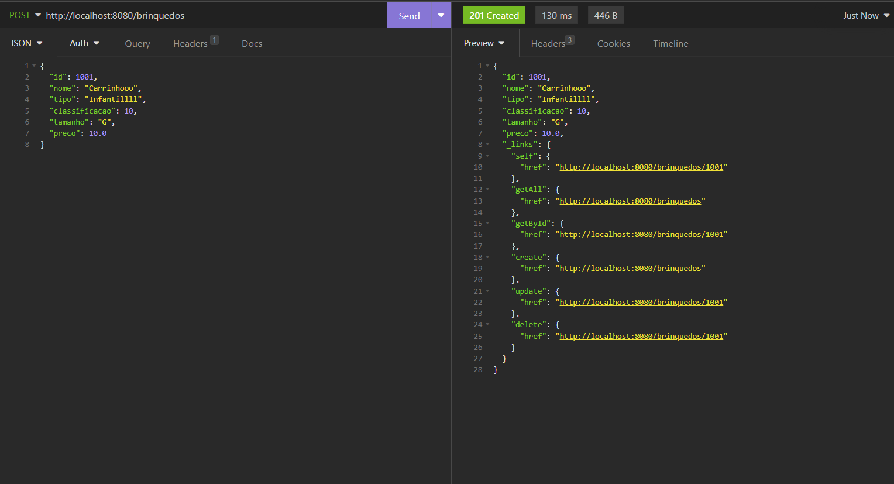
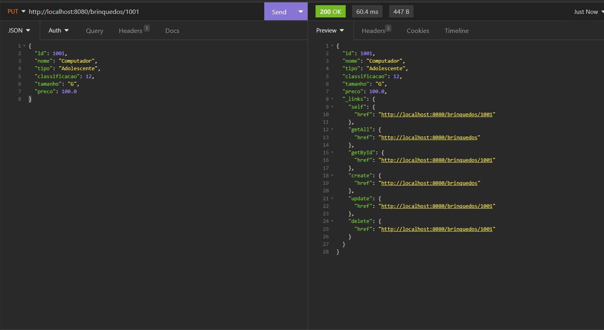
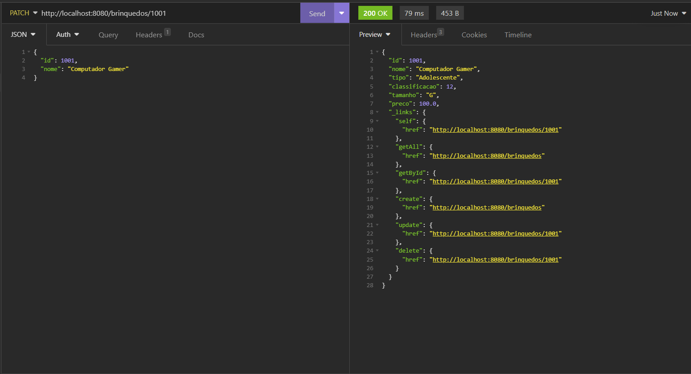
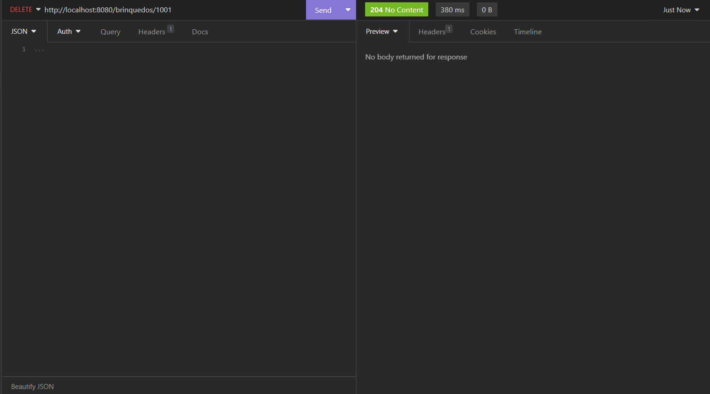

<h1>Integrantes</h1>

Denner de Oliveira Duarte - RM551938

Lucas Petroni - RM 97861

Matheus Paulo de Lima Delgado - RM552189

Nathaly Oliveira - RM552538

Caio Boris Andrulis - RM552496

<h1>Link do versionamento em nuvem</h1>

https://lojafiap2tdsr.azurewebsites.net/

<h1>Sistema de Gerenciamento de Loja de Brinquedos</h1>

Este projeto é um Sistema de Gerenciamento de Loja de Brinquedos desenvolvido utilizando o framework Spring Boot configurado com Maven, e escrito em Java no Eclipse. O objetivo é fornecer funcionalidades básicas de CRUD (Criar, Ler, Atualizar, Deletar) para gerenciar brinquedos para crianças de até 12 anos. O projeto utiliza a biblioteca Lombok para reduzir o código repetitivo e implementa o HATEOAS (Hypermedia as the Engine of Application State) para uma API RESTful com um nível de maturidade 3.

<h2>Funcionalidades</h2>
<ul>
    <li>Criar: Adicionar novos brinquedos ao sistema.</li>
    <li>Ler: Recuperar informações sobre brinquedos, incluindo detalhes como nome, tipo, classificação, tamanho e preço.</li>
    <li>Atualizar: Modificar informações de brinquedos existentes.</li>
    <li>Deletar: Remover brinquedos do sistema.</li>
</ul>

<h2>Tecnologias Utilizadas</h2>
<ul>
    <li>Java</li>
    <li>Spring Boot</li>
    <li>Maven</li>
    <li>Lombok</li>
    <li>Oracle SQL Developer</li>
</ul>

<h2>Começando</h2>

Configuração do Spring Initializer e dependências.

<ol>
    <li>Clone o repositório para sua máquina local.</li>
    <li>Importe o projeto para sua IDE preferida.</li>
    <li>Configure o banco de dados Oracle e as informações de conexão em <code>application.properties</code>.</li>
    <li>Construa o projeto utilizando o Maven.</li>
    <li>Rode a aplicação.</li>
</ol>

<h2>Uso</h2>
<ol>
    <li>Utilize o Postman para fazer requisições HTTP e interagir com os endpoints da API.</li>
    <li>Endpoints:</li>
    <ul>
        <li>GET /brinquedos: Recupera informações sobre todos os brinquedos.</li>
        <li>GET /brinquedos/{id}: Recupera informações sobre um brinquedo específico.</li>
        <li>POST /brinquedos: Adiciona um novo brinquedo ao sistema.</li>
        <li>PUT /brinquedos/{id}: Atualiza informações sobre um brinquedo específico.</li>
        <li>PATCH /brinquedos/{id}: Atualiza informações sobre um brinquedo específico.</li>
        <li>DELETE /brinquedos/{id}: Remove um brinquedo do sistema.</li>
    </ul>
    <li>Garanta que os payloads de requisição necessários estejam no formato JSON ao fazer requisições POST, PUT e PATCH.</li>
</ol>

<h2>Chamadas ao Serviço</h2>
<h3>Requisição GET /brinquedos</h3>

Método: GET 
URL: /brinquedos 
Requisição: Nenhuma 
Resposta: Lista de todos os brinquedos cadastrados no sistema.

<pre><code>
    [
        {
            "id": 1,
            "nome": "Carrinhooo",
            "tipo": "Infantillll ae",
            "classificacao": 10,
            "tamanho": "G",
            "preco": 10.0,
            "links": [
                {
                    "rel": "self",
                    "href": "http://localhost:8080/brinquedos/1"
                },
                {
                    "rel": "getAll",
                    "href": "http://localhost:8080/brinquedos"
                },
                {
                    "rel": "getById",
                    "href": "http://localhost:8080/brinquedos/1"
                },
                {
                    "rel": "create",
                    "href": "http://localhost:8080/brinquedos"
                },
                {
                    "rel": "update",
                    "href": "http://localhost:8080/brinquedos/1"
                },
                {
                    "rel": "delete",
                    "href": "http://localhost:8080/brinquedos/1"
                }
            ]
        }, ...
]
</code></pre>

<h3>Requisição GET /brinquedos/{id}</h3>

Método: GET 
URL: /brinquedos/{id} 
Requisição: Nenhuma 
Resposta: Informações do brinquedo com o ID especificado.

<code><pre>
    {
        "id": 1,
        "nome": "Carrinhooo",
        "tipo": "Infantillll ae",
        "classificacao": 10,
        "tamanho": "G",
        "preco": 10.0,
        "_links": {
            "self": {
                "href": "http://localhost:8080/brinquedos/1"
            },
            "getAll": {
                "href": "http://localhost:8080/brinquedos"
            },
            "getById": {
                "href": "http://localhost:8080/brinquedos/1"
            },
            "create": {
                "href": "http://localhost:8080/brinquedos"
            },
            "update": {
                "href": "http://localhost:8080/brinquedos/1"
            },
            "delete": {
                "href": "http://localhost:8080/brinquedos/1"
            }
        }
    }
</pre></code>

<h3>Requisição POST /brinquedos</h3>

Método: POST 
URL: /brinquedos 
Requisição: Novo brinquedo a ser adicionado ao sistema, em formato JSON. 

<code><pre>
    {
        "id": 1001,
        "nome": "Carrinhooo",
        "tipo": "Infantillll",
        "classificacao": 10,
        "tamanho": "G",
        "preco": 10.0
    }
</pre></code>

Resposta: Informações do novo brinquedo adicionado ao sistema.

<code><pre>
    {
        "id": 1001,
        "nome": "Carrinhooo",
        "tipo": "Infantillll",
        "classificacao": 10,
        "tamanho": "G",
        "preco": 10.0,
        "_links": {
            "self": {
                "href": "http://localhost:8080/brinquedos/1001"
            },
            "getAll": {
                "href": "http://localhost:8080/brinquedos"
            },
            "getById": {
                "href": "http://localhost:8080/brinquedos/1001"
            },
            "create": {
                "href": "http://localhost:8080/brinquedos"
            },
            "update": {
                "href": "http://localhost:8080/brinquedos/1001"
            },
            "delete": {
                "href": "http://localhost:8080/brinquedos/1001"
            }
        }
    }
</pre></code>

<h3>Requisição PUT /brinquedos/{id}</h3>

Método: PUT 
URL: /brinquedos/{id} 
Requisição: Atualização de brinquedo no sistema, em formato JSON. 

<code><pre>
    {
        "id": 1001,
        "nome": "Computador",
        "tipo": "Adolescente",
        "classificacao": 12,
        "tamanho": "G",
        "preco": 100.0
    }
</pre></code>

Resposta: Informações do novo brinquedo adicionado ao sistema.

<code><pre>
    {
        "id": 1001,
        "nome": "Computador",
        "tipo": "Adolescente",
        "classificacao": 12,
        "tamanho": "G",
        "preco": 100.0,
        "_links": {
            "self": {
                "href": "http://localhost:8080/brinquedos/1001"
            },
            "getAll": {
                "href": "http://localhost:8080/brinquedos"
            },
            "getById": {
                "href": "http://localhost:8080/brinquedos/1001"
            },
            "create": {
                "href": "http://localhost:8080/brinquedos"
            },
            "update": {
                "href": "http://localhost:8080/brinquedos/1001"
            },
            "delete": {
                "href": "http://localhost:8080/brinquedos/1001"
            }
        }
    }
</pre></code>

<h3>Requisição PATCH /brinquedos/{id}</h3>

Método: PATCH 
URL: /brinquedos/{id} 
Requisição: Atualização de brinquedo no sistema, em formato JSON. 

<code><pre>
    {
        "id": 1001,
        "nome": "Computador Gamer"
    }
</pre></code>

Resposta: Informações do novo brinquedo adicionado ao sistema.

<code><pre>
    {
        "id": 1001,
        "nome": "Computador Gamer",
        "tipo": "Adolescente",
        "classificacao": 12,
        "tamanho": "G",
        "preco": 100.0,
        "_links": {
            "self": {
                "href": "http://localhost:8080/brinquedos/1001"
            },
            "getAll": {
                "href": "http://localhost:8080/brinquedos"
            },
            "getById": {
                "href": "http://localhost:8080/brinquedos/1001"
            },
            "create": {
                "href": "http://localhost:8080/brinquedos"
            },
            "update": {
                "href": "http://localhost:8080/brinquedos/1001"
            },
            "delete": {
                "href": "http://localhost:8080/brinquedos/1001"
            }
        }
    }
</pre></code>

<h3>Requisição DELETE /brinquedos/{id}</h3>

Método: DELETE 
URL: /brinquedos/{id} 
Requisição: Nenhuma 
Resposta: Nenhuma

